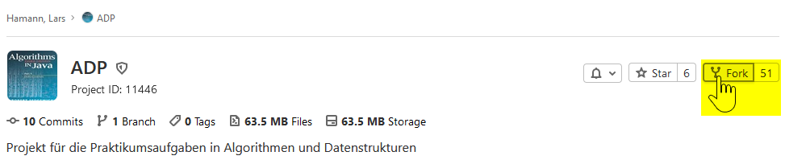
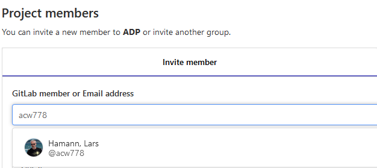
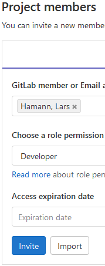
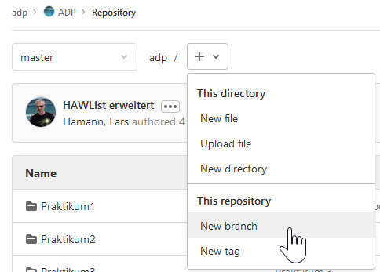
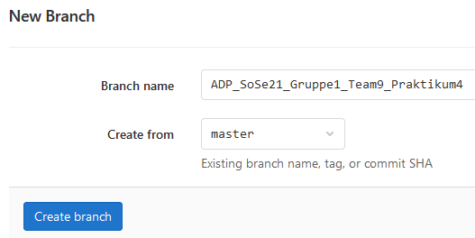
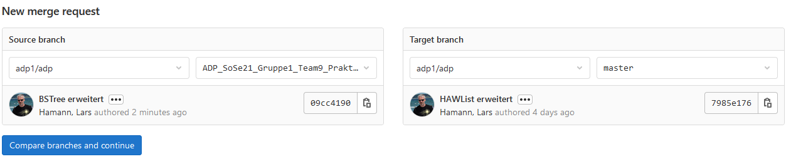
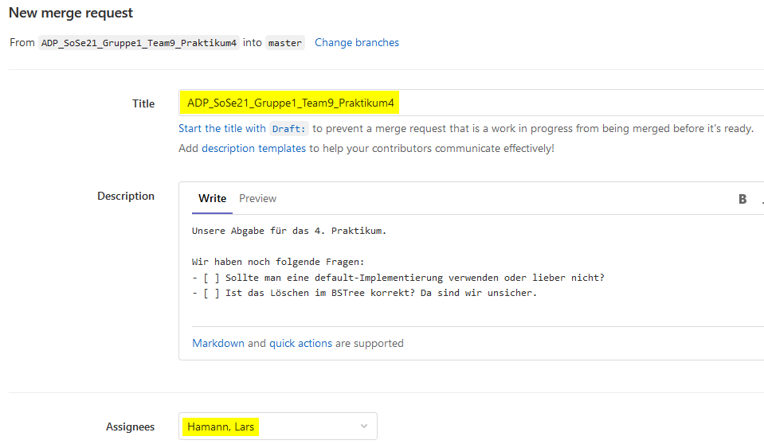

# ADP

Projekt für die Praktikumsaufgaben in Algorithmen und Datenstrukturen.

Je nach Aufgabenstellung sind unterschiedliche Bereiche dieses Repositories zu bearbeiten.

## Anleitung

Die Aufgaben für das Praktikum sollen Sie in einem eigenen Projekt, das von diesem Projekt geforkt wurde, lösen. Die eigentliche Abgabe der Implementierungsaufgaben geschieht über einen Merge Request. Die nachfolgende Anleitung erläutert dieses Vorgehen im Detail.

### 1. Projekt forken

Das hier veröffentlichte Projekt müssen Sie in ein eigenes Projekt [forken](https://docs.gitlab.com/ee/user/project/repository/forking_workflow.html), d. h. Sie erzeugen einen Clone dieses Projektes, den Sie beliebig ändern können, ohne dass es Einfluss auf dieses Projekt hat.

Um das Projekt zu forken wählen Sie die Funktion ```Fork``` auf der Startseite des Projekts.
Dort sollten Sie sich gerade befinden.

#### Schritt 1: Forkvorgang starten



#### Schritt 2: Namespace auswählen

Wird in der Regel Ihr Usernamespace sein.

### 2. Zugriff für mich gewähren

#### Schritt 1: Auf *Members* im linken Menü gehen

#### Schritt 2: Meinen Useraccount *acw778* auswählen



#### Schritt 3: Meinen Useraccount *acw778* auswählen

#### Schritt 4: Developer Rechte geben



### 3. Branch für das Praktikum anlegen

Pro Praktikum (pro Aufgabenblatt) sollten Sie einen eigenen Branch anlegen.
Dadurch sehen wir später leichter nur die für diese Aufgabe relevanten Änderungen.

#### Schritt 1: In der Repository-Anzeige einen Branch anlegen



*Hinweis: Das können Sie auch über andere Wege machen, hier dieser Weg zur Erklärung.*

#### Schritt 2: Branch benennen



**!!!Achtung wichtig!!!**

Bitte nutzen Sie das oben verwendete Muster für den Namen Ihres Branches.
Der Aufbau ist wie folgt:

```bash
ADP_(SoSe|WiSe){$Jahr}_Gruppe{$Praktikumsgruppe}_Team{$Teamnummer}_Praktikum{$NummerdesPraktikums}
```

Im Screenshot wird also ein Branch für das 4. Praktikum im Sommersemester 2021 des Teams 9 der 1. Praktikumsgruppe angelegt.

#### Schritt 3: Branch erstellen

### 4. Aufgabe bearbeiten

Sie können nun lokal auf den vorher erzeugten Branch wechseln (`fetch`/`pull` nicht vergessen) und die Aufgaben bearbeiten.

Nachdem Sie Ihre Bearbeitung abgeschlossen haben und alle Änderungen "gepusht" sind geht es weiter.

### 5. Merge Request anlegen und "abgeben"

#### Schritt 1: Merge Request anlegen starten

Unter *Merge Requests* im Menü auf der linken Seite *New Merge Request* wählen.

#### Schritt 2: Source- und Target-Branch wählen



Wählen Sie hier den vorher erzeugten *Praktikumsbranch* als Quelle (Source) und **ihren** Masterzweig al Ziel (Target). Wählen Sie hier *nicht* den Masterzweig aus dem Ursprungsprojekt.

#### Schritt 3: Merge-Request Daten erfassen

Nachdem Sie *Compare Branches and Continue* gewählt haben, müssen Sie die Daten des Merge Requests vervollständigen.



Wichtig ist wieder der Name: hier den Branchnamen verwenden.
Weiterhin müssen Sie mich als "Assignee" hinzufügen. Damit werde ich informiert, dass etwas zur Begutachtung vorliegt.

Nutzen Sie auch die Möglichkeit über die Beschreibung Fragen oder Hinweise mitzugeben.

Ein besonderer Vorteil der Arbeit mit Merge Requests ist, dass ich vor dem Praktikum bereits Feedback geben kann (wenn ich dazu komme).

## Enthaltene Aufgaben

### Praktikum 1 (Name wird noch gesucht)

Das erste Praktikum dreht sich zum Einen um die Spezifikation von Datentypen ohne Implementierung.
Dazu verwenden wir die Anwendung [USE](https://sourceforge.net/projects/useocl/ "UML-based Specification Environment"),
die es erlaubt UML-Modelle zu simulieren.
Weiterhin beschäftigen wir uns mit der Komplexität von Algorithmen.
Dazu betrachten wir ein einfaches Java-Programm und messen seine Laufzeit.

### Praktikum 2 (Name noch gesucht)

Das Zweite Praktikum soll bespielhaft die Implementierung von
gängigen Datenstrukturen und Sortieralgorithmen vertiefen.

Dazu soll ein Anfang für eine Lösung des sogenannten ["River Crossing" Problems](http://anim.ide.sk/crossing.php) gemacht werden. Wir betrachten die Aufgabenstellung Monster und Kinder.  Im Aufgabenordner finden Sie das Skelett einer Implementierung. Hier fehlt allerdings die Implementierung der HAWList-Datenstruktur. Auch müssen noch einige Änderungen am Lösungsalgorithmus gemacht werden.

### SortingWorkbench

Vorlage für ein Projekt, um relativ einfach Sortieralgorithmen analysieren zu können.
Die Analysefunktionen sind vorimplementiert und können recht einfach bei der Umsetzung der
Sortieralgorithmen eingebunden werden.
